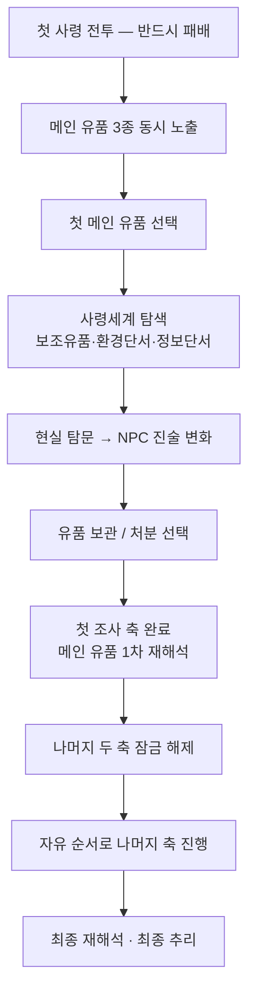

# 메인 유품 선택에 따른 진행 순서

> 원문 제목 주석: "음 일단 초안이고 마지막에 검토거리 있음"
> **2026-08-04 편집 — 이 문서군 전체에서 가장 최근 문서.** Notion 인증 상태는 `unverified`이며 하단에 미해결 코멘트 스레드가 남아 있다.

## 설계 목적

플레이어는 챕터 초반에 **메인 유품 3개(과거·현재·미래)를 모두** 확인할 수 있다.

- 메인 1. 졸업사진 (과거) → [[조사축_과거_졸업사진]]
- 메인 2. 핸드폰 (현재) → [[조사축_현재_핸드폰]]
- 메인 3. 취준 파일 (미래) → [[조사축_미래_취준파일]]

세 유품 모두 처음부터 노출되지만, **첫 번째로 선택한 메인 유품만 활성 조사 축이 된다.** 이를 통해 플레이어는 게임의 핵심 조사 루프와 루트 선택 시스템을 자연스럽게 학습한다.

---

## 진행 흐름

### 0단계. 첫 사령 전투 패배 (공통)
첫 사령과 조우 → 전투 진행 → **정사에서는 반드시 패배** → 현실로 복귀 → 탐문 및 조사 기능 개방

### 1단계. 메인 유품 3종 동시 노출
플레이어는 원룸에서 졸업사진 · 핸드폰 · 취준 파일을 **모두** 발견한다. 이 시점에는 모두 **의미를 알 수 없는 핵심 단서**일 뿐이다.

### 2단계. 첫 메인 유품 선택
세 유품 중 하나를 선택해 조사한다. 선택한 유품은 **해당 사령세계 개방 + 해당 조사 축 활성화**를 담당한다. 나머지 두 유품은 계속 확인할 수 있지만 본격적인 진행은 잠시 제한된다.

### 3단계. 선택한 사령세계 탐색
연결된 사령세계에 진입해 **보조 유품 2개 · 환경 단서 · 정보 단서**를 획득한다. 이 단계에서는 아직 모든 진실이 드러나지 않는다.

### 4단계. 현실 탐문
현실로 돌아와 획득한 단서로 관련 NPC를 탐문한다. NPC는 **최초 인식 → 1차 진술 변화 → 2차 진술 변화**를 통해 고인을 다시 해석하게 만든다.

### 5단계. 첫 루트 선택 경험 (튜토리얼 역할)
보조 유품 확보 후 처음으로 **유품 처리 방식(보관 / 처분)** 을 선택한다. 이 선택으로 **이해 루트 / 제령 루트 / 소멸 루트**의 차이를 처음 경험한다.

### 6단계. 첫 조사 축 완료
선택한 메인 유품의 사령세계·보조 유품·NPC 진술 변화가 완료되면 메인 유품이 **1차 재해석**된다. 이후 **나머지 두 메인 유품의 조사 제한이 해제**된다.

### 7단계. 나머지 두 조사 축 자유 진행
이후에는 원하는 순서대로 세 축을 진행할 수 있다. 이미 조사 루프와 루트 시스템을 학습했기 때문에 별도의 제한을 두지 않는다.

### 8단계. 최종 재해석
세 메인 유품의 조사와 NPC 진술 변화가 모두 완료되면 메인 유품 3개가 다시 등장한다. 이번에는 단순한 단서가 아니라 **추리 및 재해석의 대상**으로 사용된다. 플레이어는 고인의 삶을 하나의 이야기로 재구성하게 된다.

---

## 구조 요약

## 이 구조의 장점 (원문: "ai 피셜이긴 한데 나도 공감함")

- **초반 선택의 의미를 살린다.** 플레이어가 직접 첫 조사 축을 결정한다.
- **튜토리얼을 시스템 안에 녹인다.** 조사·사령세계·NPC·유품 처리·루트 선택을 첫 축에서 모두 경험한다.
- **후반 자유도를 보장한다.** 첫 축 이후에는 원하는 순서로 나머지를 조사할 수 있다.
- **세 루트 모두 지원한다.** 이해(성불)·제령·소멸이 같은 조사 구조 위에서 자연스럽게 분기된다.
- **메인 유품의 재활용이 자연스럽다.** 초반에는 '열쇠', 후반에는 '재해석 대상'.

---

## 미결 사항 ①. 나머지 두 축은 언제 열리는가

| 후보 | 내용 | 평가 |
|---|---|---|
| ① 사령세계 첫 진입만 하면 개방 | 자유도 높음 | 튜토리얼 효과 약함 |
| ② 보조 유품 2개 획득까지 완료 | 조사 루프를 충분히 익힘 | — |
| ③ **NPC 1차 진술 변화까지 완료** | 현실+사령세계 모두 경험 후 자유도 부여 | **문서 작성자 현재 선호안 (가장 균형 좋음)** |

> 코멘트: "이부분이 고민거린데 난 2번도 괜찮다고 생각은 함. 3번이 진짜 정배인데 자유도는 2번같아서.. 뭐 사실 상관없을거같기도?"

## 미결 사항 ②. 판매 금지 핵심 유품 범위

> 결국 이해도 시스템과 유품판매시스템의 충돌에서 오는 거 같은데. 일단 **핵심 물품은 판매불가 확정**이다.
> - **졸업사진** → 어머니에게 인계 (판매 불가)
> - **고양이** → 보호 및 인계 (판매 불가)
> - **자살 메모** → 증거물 성격 (판매 불가)
> - 핵심 유품 일부는 애초에 관리인이 판매를 거부한다.
>
> 그럼 보조유품을 판매로 가야함. 내 제안이야 함 읽어보고 답줘 정하고 가자.
> ——추가: 그럼 보조유품을 만약 **사령세계에서 얻는다고 가정했을 때 판매는 무조건 현실에서만** 하는 게 연출적으로 좋아보이는데 어떻게 생각함?

**상태**: 답변 없음 (2026-08-04 이후 스레드 정지). 첨부 `제안_1.docx`는 Notion 원본에만 존재.

> ⚠️ 이 목록(졸업사진·고양이·자살 메모)은 위 3대 메인 유품(졸업사진·핸드폰·취준파일)과도 다르다. [[_INDEX]] "확인 필요 사항" §2 참조.

## 관련 문서
[[00_확정메모_및_작업계획]] · [[조사축_과거_졸업사진]] · [[조사축_현재_핸드폰]] · [[조사축_미래_취준파일]] · [[플레이_유도]]
