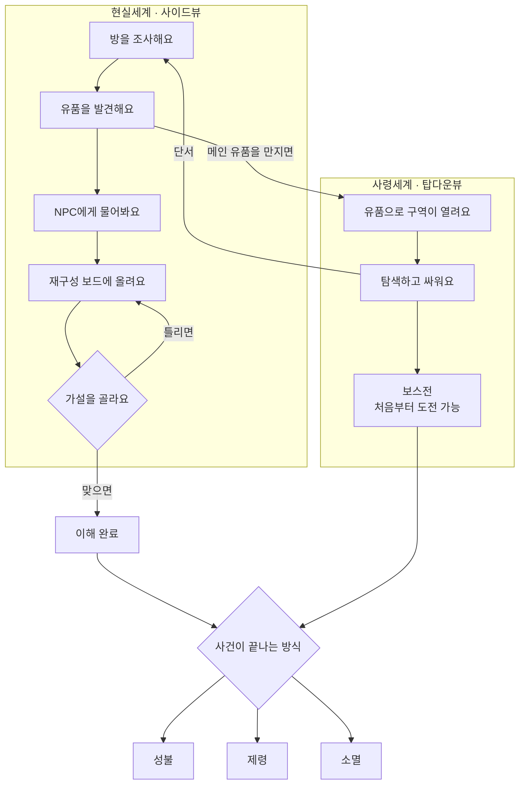

> **한 줄**: 현실에서 유품을 모아 고인을 오해하고, 사령세계에서 그 오해가 깨지며, **얼마나 이해했는가가 사건을 끝내는 방식을 바꾸는** 게임이에요.

# 개요

플레이어는 특수청소·유품정리사예요. 겉으로는 고독사 현장을 정리하는 일이지만, 실제로는 현장에 남은 **잔류 사념**을 감지하고 고인의 사령세계를 조사해요.

이 게임의 특별한 점은 **"강해지는 게 보상이 아니라는 것"** 이에요. 고인을 이해할수록 플레이어가 세지지는 않아요. 대신 **사건을 어떤 방식으로 끝낼 수 있는지가 달라져요.**

## 코어 루프

플레이어는 이 루프를 돌면서 **처음 내린 판단을 스스로 뒤집게** 돼요. 챕터1에서는 "고양이를 남겨두고 죽은 무책임한 사람"이라는 첫인상이 마지막엔 완전히 다른 것으로 바뀌어요.

## 개념

문서 전체에서 쓰는 말 **세 개**만 알면 돼요. 위 그림에서 어디인지로 설명할게요.

- **이해도** — 그림 오른쪽 아래 `이해 완료`로 가는 게 이해도예요. 고인의 삶을 얼마나 재구성했는지를 재는 값이고, **네 단계(관찰 → 연결 → 검증 → 재해석)** 로 되어 있어요. 플레이어에게 숫자로 보여주지 않아요.

- **유품** — 그림 왼쪽 `유품을 발견해요`에서 얻는 물건이에요. **핵심**과 **보조** 두 등급뿐이고, 구분 기준은 **팔 수 있는지**예요. 핵심은 못 팔고, 보조는 팔아서 생존템을 살 수 있어요. 이게 나중에 "소멸" 엔딩으로 이어져요.

- **사령세계** — 그림 오른쪽 전체예요. 고인의 감정이 왜곡된 공간이고, **메인 유품이 열쇠**가 돼서 구역이 하나씩 열려요. 현실세계와 시점이 달라요(현실은 사이드뷰, 사령세계는 탑다운뷰).

> 💡 **`이해도`와 `유품`을 헷갈리기 쉬워요.**
> 유품을 많이 주워도 이해도는 안 올라요. **재해석과 연결이 있어야** 올라가요. "다 주웠는데 이해 못 함"이 성립하는 게 이 게임의 핵심이에요.

## 이 문서를 읽는 방법

| 지금 필요한 게 | 어디로 |
|---|---|
| 왜 이렇게 설계했는지 | [핵심 원칙](../1_소개/핵심원칙.md) |
| 내 파트에서 뭘 봐야 하는지 | [내 파트 찾기](../2_가이드/내_파트_찾기.md) |
| 정확한 규칙 수치 | **3. 레퍼런스** |
| 챕터1 실제 내용 | **5. 예제** |
| 지금 뭐가 막혀 있는지 | **6. 현황 › 검토 필요** |

---

다음은 **[핵심 원칙](../1_소개/핵심원칙.md)** 을 보세요. 이 게임의 설계 결정 세 가지를 "이 규칙이 없으면 어떻게 되는지"로 설명해요.
