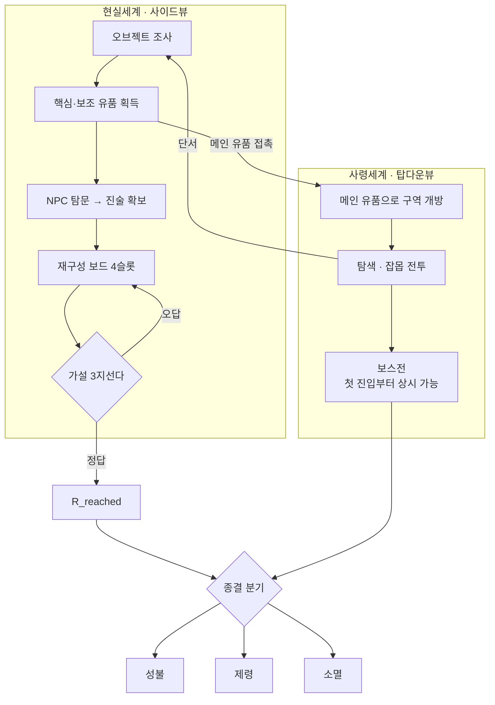

> **한 줄**: 현실에서 유품을 모아 고인을 오해하고, 사령세계에서 그 오해가 깨지며, **얼마나 이해했는가가 종결 방식을 바꾸는** 게임.

# 게임 전체 요약

항상 컨텍스트에 넣어도 되는 크기의 다이제스트. 세부는 `LLM.md` 라우팅 표 참조.

## 기본 사양

| 항목 | 내용 | 상태 |
|---|---|---|
| 장르 | 내러티브 추리 + 메트로배니아 ARPG | 확정 |
| 플랫폼 | PC | 확정 |
| 시점 | 현실 = 사이드뷰 / 사령세계 = 탑다운뷰 | 확정 |
| 전투 | 가벼운 액션, 회피만 (패링·가드 없음) | 확정 |
| 챕터 구조 | 케이스 1건 = 챕터 1개 | 확정 |
| 챕터1 케이스 | 김태현 (30세, 고독사) | 확정 |
| 목표 | 챕터1 데모 2027-06 | — |

플레이어는 특수청소·유품정리사(**기록관**)로서 고독사 현장에 투입된다. 표면적으로는 방을 정리하는 일이지만, 실제로는 현장에 남은 **잔류 사념**을 감지하고 고인의 사령세계를 조사한다.

## 코어 루프

## 설계 3원칙

**① 이해도는 전투력이 아니라 종결 열쇠다.**
이해도가 올라도 플레이어는 강해지지 않는다. 적이 읽히게 될 뿐이고, 진짜 보상은 **어떤 방식으로 사건을 끝낼 수 있는가**가 바뀌는 것이다. (`01-01`)

**② 플레이어는 반드시 한 번 오해해야 한다.**
정답을 찾아가는 경험이 아니라 **스스로 잘못 판단하고 수정하는 경험**이다. 모든 단서는 "정답 제공"이 아니라 "기존 해석을 흔드는 역할". (`04-08`)

**③ 게임이 결론을 말해주지 않는다.**
NPC는 자신이 본 것만 증언한다. 환경은 설명하지 않고 모순을 보여준다. 최종 해석은 플레이어가 스스로 도달한다. (`04-04`, `04-07`)

## 시스템 한 줄씩

| 시스템 | 핵심 | 파일 |
|---|---|---|
| 이해도 | 인식 변화량. UI 비노출, 전투력 강화 없음 | `01-01` |
| 이해도 표현 | O→A→V→R 4개 boolean, 순서 의존 | `01-02` |
| 이해도 출력 | 보스 패턴 가시성 + 종결 해금 **2종뿐** (잡몹 무관) | `01-03` |
| 아이템 | 핵심 3개(판매불가) / 보조 10~12개(판매가능) | `01-05` |
| 재구성 보드 | 4슬롯 · 4 STEP · all-or-nothing 검증 | `01-06` |
| 가설 | 정답1 + 오답2 = 3지선다 고정 | `01-07` |
| 종결 | 성불(OAVR) / 제령(OAV) / 소멸(A 미달) | `01-08` |
| 사령세계 | 메트로배니아. 보스방은 분리된 독립 공간, 첫 진입부터 도전 가능 | `02-01` |
| 전투 | 가벼움 + 회피만. 패링·가드 금지 | `03-01` |

## 챕터1 한 줄

> '보답해야 한다'는 책임감이 실패를 숨겨야 한다는 압박으로 변했고, 끝내 누구에게도 도움을 요청하지 못한 채 극단적 선택에 이른 청년의 사건.

| | 내용 | 파일 |
|---|---|---|
| 고인 | 김태현, 30세, 무직(취업 준비), 원룸 독거, 고양이 1마리 | `04-02` |
| 공간 | 7~8평 원룸. **중문**이 "세상에 대한 책임"과 "무너진 자기 삶"을 가른다 | `04-03` |
| NPC | 관리인 · 집주인 · 이유미 · 상담사 · 어머니 | `04-04` |
| 메인 유품 | 졸업사진(과거) / 핸드폰(현재) / 취준파일(미래) ※검토필요 | `04-05` |
| 첫 오판 | "고양이를 남겨두고 죽은 무책임한 사람" | `04-06` |
| 최종 인식 | "주변이 몰아붙인 게 아니라, 스스로 기대를 짊어졌다" | `04-08` |

## 지금 막혀 있는 것

| # | 항목 | 파일 |
|---|---|---|
| 1 | **사령세계 획득 구조** — 순차 체인 vs 동시 노출로 서술이 갈림. 레벨디자인 전제가 통째로 갈리는 지점 | `06-03` |
| 2 | **메인 유품 명칭** — 문서마다 다름 (4가지 버전) | `06-03` |
| 3 | 1단계(O) 임계값 N — 맵 초안이 나와야 정할 수 있음 | `06-02` |
| 4 | 컷오프 정의 + R 미달 보스전 결과 | `06-02` |
| 5 | 사령세계 1·2·3 설계 자체가 미작성 | `06-02` |

## 상태 분포

| | 개수 |
|---|---|
| ADR 확정 (Accepted) | 10 |
| ADR 제안 (Proposed) | 4 |
| 미결 트래커 | 9 |
| 검토 필요 (문서 간 불일치) | 4 + 어긋난 문서 14건 |
