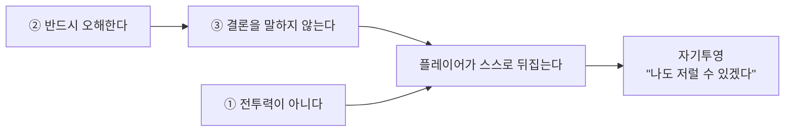

> **한 줄**: 이 게임의 설계 결정 세 가지 — **① 이해도는 전투력이 아니에요 ② 플레이어는 반드시 한 번 오해해야 해요 ③ 게임이 결론을 말해주지 않아요.** 각각 "이 규칙이 없으면 어떻게 되는지"로 설명할게요.

# 핵심 원칙

---

## 원칙 1. 이해도는 전투력이 아니에요

### 이 규칙이 없으면

이해도가 오를 때 플레이어를 강하게 만들면, 이런 게임이 돼요.

```
고인을 이해한다 → 데미지 +10% → 보스를 더 쉽게 이긴다
```

그럼 플레이어는 이렇게 받아들여요.

- **"조사는 버프 파밍이구나."** 고인의 삶이 아니라 스탯을 보게 돼요
- 반대로 조사를 안 하면 **"전투력이 깎였다"** 고 느껴요. 페널티로 읽히죠
- 무엇보다 — **이해하지 않기로 선택한 플레이어에게 이 게임은 그냥 어려운 게임**이 돼요. "소멸" 루트가 벌칙이 되어버려요

구 GDD v1.0이 실제로 "이해도 = 전투력"으로 정의했었고, 이 문제 때문에 폐기됐어요.

### 그래서 이렇게 정했어요

이해도는 **플레이어 스탯에 일절 관여하지 않아요.** 데미지·체력·공속 어느 것도요.

대신 두 가지만 바꿔요.

| 이해도가 오르면 | 무슨 일이 |
|---|---|
| **보스 패턴이 읽혀요** | 공격이 더 일찍·명확하게 보여요. 플레이어가 강해진 게 아니라 **적이 읽히게** 된 거예요 |
| **끝내는 방법이 열려요** | 성불 / 제령 / 소멸 중 무엇을 고를 수 있는지가 달라져요 |

잡몹은 이해도와 **완전히 무관**해요. 처음부터 끝까지 똑같아요.

### 얻는 것

- 조사가 **파밍이 아니라 이해**가 돼요
- 소멸 루트가 **벌칙이 아닌 선택**이 돼요. 유품을 팔아 생존템을 사는 것도 정당한 플레이예요
- "이해할수록 잘 싸운다"는 컨셉이 **스탯이 아니라 인지**로 구현돼요

### 대신 감당하는 것

수치를 안 보여주니 **진행도 체감이 100% 작가 대사와 아트 연출에 달려 있어요.** 작업량 부담을 전제로 한 결정이에요.

> 근거: ADR-1 · ADR-9 · 규칙 전문: `01-01` `01-03`
> 왜 수치를 아예 안 보여주나 → [왜 이해도를 안 보여주나](../4_심화/왜-이해도를-안보여주나.md)

---

## 원칙 2. 플레이어는 반드시 한 번 오해해야 해요

### 이 규칙이 없으면

플레이어가 처음부터 고인을 동정하게 만들면 이렇게 돼요.

```
방에 들어간다 → "아, 힘들었구나" → 조사한다 → "역시 힘들었네" → 끝
```

- **추리가 아니라 확인**이 돼요. 이미 아는 걸 확인하는 절차죠
- 단서를 발견해도 **감정이 안 움직여요.** 예상대로니까요
- 고인이 **"불쌍한 사람"이라는 납작한 캐릭터**로 끝나요

### 그래서 이렇게 정했어요

**잘못된 판단을 내리는 것이 정상적인 플레이예요.**

챕터1에서 플레이어는 중문 바깥에 붙은 메모를 가장 먼저 읽어요.

> *"죄송합니다. 고양이 이름은 ○○입니다. 이 아이만은 잘 부탁드립니다."*

그리고 이렇게 판단해요 — **"고양이를 남겨두고 죽은 무책임한 사람."**

이건 실수가 아니라 **의도된 설계**예요. 그래서 O 단계에서는 취업 준비 흔적·상담 기록·졸업사진의 의미를 **절대 보여주지 않아요.**

모든 단서는 **"정답 제공"이 아니라 "기존 해석을 흔드는 역할"** 을 해요.

| 단계 | 플레이어가 믿는 것 | 실제 |
|---|---|---|
| 관찰 | 무기력한 백수 | (아직 안 보여줌) |
| 연결 | 사람들과 관계를 끊었다 | 끊고 싶었던 게 아니었다 |
| 검증 | 생각보다 많이 노력했다 | 노력했지만 실패를 말하지 못했다 |
| 전환 | 주변이 압박했다 | **아무도 압박하지 않았다** |
| 재해석 | 왜 말하지 않았지? | **말하지 못했던 사람이었다** |

### 얻는 것

- 마지막 감정이 **동정이 아니라 자기투영**이 돼요. "불쌍하다" 대신 **"나도 저럴 수 있겠다"**
- 단서 하나하나가 **판단을 뒤집는 사건**이 돼요
- 고인이 선인도 악인도 아닌 **모순을 가진 한 사람**으로 남아요

### 대신 감당하는 것

**정보 공개 순서를 엄격히 통제해야 해요.** 어느 단계에서 무엇을 보여주면 안 되는지가 케이스마다 설계돼야 하고, 실수로 하나 노출되면 그 시점에 추리가 끝나요.

> 근거: 스토리 설계 · 규칙 전문: `04-08`

---

## 원칙 3. 게임이 결론을 말해주지 않아요

### 이 규칙이 없으면

누군가 이 대사를 하는 순간 게임이 끝나요.

> ❌ *"기대가 부담이 되었던 거예요."*

- 플레이어가 **스스로 도달할 기회를 잃어요.** 결론을 받아 적게 되죠
- 그 순간 남은 단서들이 **무의미**해져요
- 재해석 단계가 **연출 감상**으로 격하돼요

### 그래서 이렇게 정했어요

**NPC는 진실을 아는 존재가 아니에요.** 자신이 본 것만 말해요.

| NPC의 성질 | 예 |
|---|---|
| **거짓말은 안 해요. 하지만 틀려요** | "취업 준비도 안 하던데." — 실제로는 엄청 많이 했어요 |
| **추측해요** | "우울증이었겠죠." |
| **피해자를 정의하지 않아요** | "착한 사람" / "나쁜 사람"이라고 말하지 않아요 |
| **자기 시점만 알아요** | 옆집 주민은 고양이만, 상담사는 취업만 알아요 |

그래서 NPC마다 **서로 다른 오판을 심어요.**

| NPC | 심는 오판 | 나중에 수정되는 진실 |
|---|---|---|
| 집주인 | 생활고 때문에 죽었다 | 돈보다 '기대를 저버렸다는 감정'이 컸다 |
| 이유미 | 착하고 조용한 사람이었다 | 조용한 게 아니라 힘든 걸 감췄다 |
| 상담사 | 회복되고 있었다 | 끝까지 버텼지만 도움을 요청하지 못했다 |
| 어머니 | 힘들면 말했을 것이다 | 말하지 못한 게 아니라 **말할 수 없었다** |

환경도 마찬가지예요. **설명하지 않고 모순을 보여줘요.** 중문 바깥은 정돈돼 있고 안쪽은 무너져 있어요. 그 대비만 보여주고, 무슨 뜻인지는 말하지 않아요.

### 얻는 것

- 결론이 **플레이어의 것**이 돼요. 설득당한 게 아니라 스스로 도달한 것
- NPC가 **정보 자판기가 아니라 사람**이 돼요
- 같은 사건을 두 번 플레이해도 **해석 경로가 달라질 수 있어요**

### 대신 감당하는 것

- A 단계 NPC와 V 단계 NPC를 **반드시 분리**해야 해요(각 최소 2명). 같은 NPC를 반복 탐문해 정보를 캐는 패턴을 막기 위해서예요 → 케이스당 NPC 최소 4명이 고정 비용이에요
- 작가가 **"정답을 말하지 않으면서 도달 가능하게"** 써야 해요. 가장 어려운 요구예요

> 근거: ADR-6 · 규칙 전문: `04-04`

---

## 세 원칙이 맞물리는 지점

세 원칙은 따로 있는 게 아니라 하나를 지탱해요.



**①이 없으면** 조사가 파밍이 되어 ②의 오해가 무의미해져요.
**③이 없으면** ②의 오해가 그냥 틀린 답이 되고, 뒤집는 경험이 사라져요.

---

다음은 **[시작하기](../2_가이드/시작하기.md)** 를 보세요. 처음 온 사람이 30분에 파악하는 순서예요.
