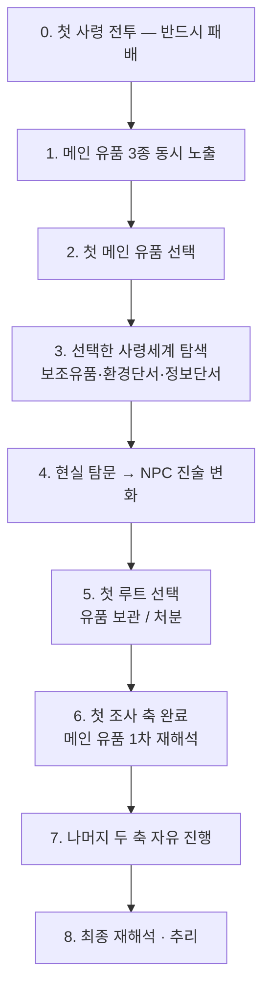

> **한 줄**: 첫 사령 전투에서 **반드시 패배** → 메인 유품 3종 동시 노출 → 하나를 골라 조사 → 첫 축 완료 후 **나머지 두 축 자유 진행** → 최종 재해석. 첫 축이 곧 튜토리얼이다.

# 챕터1 플레이 흐름

## 1. 기본 구조

```
장소 → 오브젝트 조사 → 핵심/보조 유품 발견 → NPC 해금 → 현실의 오판 형성
    → 사령세계 진입(자유) → 이해(OVAR) 갱신 → 유품 선택(보관[이해] / 처분[재화])
```

플레이어에게 **조사 순서를 강제하지 않으며**, 환경과 상호작용을 통해 자연스럽게 다음 행동을 유도한다.

## 2. 진행 순서 8단계 `잠정`



| 단계 | 내용 |
|---|---|
| **0** | 첫 사령과 조우 → 전투 → **정사에서는 반드시 패배** → 현실 복귀 → 탐문·조사 기능 개방 |
| **1** | 원룸에서 졸업사진·핸드폰·취준 파일을 **모두** 발견. 이 시점엔 모두 의미를 알 수 없는 핵심 단서 |
| **2** | 하나를 선택 → 해당 사령세계 개방 + 조사 축 활성화. 나머지 둘은 확인은 되나 진행 제한 |
| **3** | 사령세계 진입, 보조 유품 2개 + 환경 단서 + 정보 단서 획득 |
| **4** | 현실 복귀, NPC 탐문. 최초 인식 → 1차 진술 변화 → 2차 진술 변화 |
| **5** | **유품 처리 방식(보관/처분) 첫 선택** → 이해·제령·소멸 루트의 차이를 처음 경험 (**튜토리얼 역할**) |
| **6** | 사령세계·보조 유품·NPC 진술 변화 완료 → 메인 유품 **1차 재해석** → 나머지 두 축 잠금 해제 |
| **7** | 원하는 순서로 나머지 축 진행. 별도 제한 없음 |
| **8** | 메인 유품 3개가 다시 등장. 단서가 아니라 **추리 및 재해석의 대상**으로 사용 |

### 설계 의도

- **초반 선택의 의미를 살린다** — 플레이어가 직접 첫 조사 축을 결정
- **튜토리얼을 시스템 안에 녹인다** — 조사·사령세계·NPC·유품 처리·루트 선택을 첫 축에서 모두 경험
- **후반 자유도를 보장한다**
- **세 루트 모두 지원** — 이해(성불)·제령·소멸이 같은 조사 구조 위에서 분기
- **메인 유품 재활용** — 초반 '열쇠', 후반 '재해석 대상'

> 🔴 **검토필요**: 1단계의 "동시 노출"은 ADR-11(Proposed)의 순차 체인 구조와 다르다. → `06-03`, `02-02`

### 미정 — 나머지 두 축 개방 시점

| 안 | 내용 | 평가 |
|---|---|---|
| ① | 사령세계 첫 진입만 하면 개방 | 자유도↑, 튜토리얼 효과↓ |
| ② | 보조 유품 2개 획득까지 완료 | 조사 루프 학습 확보 |
| **③** | **NPC 1차 진술 변화까지 완료** | **현재 선호안 — 균형 최적** |

---

## 3. 구간별 유도 설계

| # | 구간 | 목적 | 유도 요소 | 플레이어 판단 |
|---|---|---|---|---|
| 1 | 건물 진입 | 사건의 시작과 집주인 첫인상 전달 | 신고 경위, 밀린 월세, 연락 두절 | "방에만 있던 백수" |
| 2 | 현관·중문 앞 | 고인보다 먼저 반려묘와 메모를 접하게 함 | 이동장 속 고양이, 눈에 띄는 메모, 정돈된 공간 | **"고양이를 남겨두고 떠난 무책임한 사람."** |
| 3 | 중문 통과 | 공간 분위기 급변으로 무너진 삶을 보여줌 | 어두운 조명, 어질러진 공간, 졸업사진·파일철 | "생각보다 오래 무너져 있었던 것 같다." |
| 4 | 현실 조사 | 기존 판단을 흔든다 | 조사 가능 오브젝트, 추리보드 갱신, 장소 해금 | — |
| 5 | NPC 조사 | 단서를 해석할 새 관점 제공 | 진술 해금, 추리 단계 진행 | — |
| 6 | 사령세계 | 사실이 아닌 **감정**을 플레이 | 핵심 유품, 감정 연출, 보스 | — |
| 7 | 재해석 | 스스로 첫인상을 수정 | 추리보드 완성, 단서 연결 | **최종 인식 도달** |

**NPC 방문 순서**: 집주인 → 이유미 → 상담사 → 어머니 순으로, 또는 자유롭게.

### 7번 최종 인식

> "주변은 김태현을 몰아붙이지 않았다. 김태현은 스스로 타인의 기대를 책임으로 받아들였다. 끝까지 자신의 실패를 말하지 못했다."

## 4. 설계 원칙

- 플레이어에게 **정답을 직접 설명하지 않는다**
- NPC는 진실을 말하지 않고 **자신이 본 사실만 증언**한다
- **환경은 설명하지 않고 모순을 보여준다**
- 유품은 사건이 아니라 **감정**을 전달한다
- 플레이어는 자신의 첫 판단을 **스스로 수정**해야 한다
- 조사 순서는 자유롭게 두되, **핵심 정보는 반드시 자연스럽게 노출**되도록 배치한다

## 5. 미해결 — 유품 판매 금지 범위

코멘트 스레드에서 제안된 판매 불가 목록 (답변 대기 중):

- **졸업사진** → 어머니에게 인계
- **고양이** → 보호 및 인계
- **자살 메모** → 증거물 성격
- 핵심 유품 일부는 애초에 관리인이 판매를 거부

추가 논점: 보조유품을 사령세계에서 얻는 경우 **판매는 현실에서만** 하는 게 연출적으로 좋은가?

> ⚠ 이 목록은 `04-05`의 메인 3종과도 다르다. → `06-03`

## 관련

- 메인 유품·조사축 → `04-05`
- 감정 곡선 (같은 흐름의 감정 축) → `04-08`
- 구역 개방 규칙 → `02-02`
