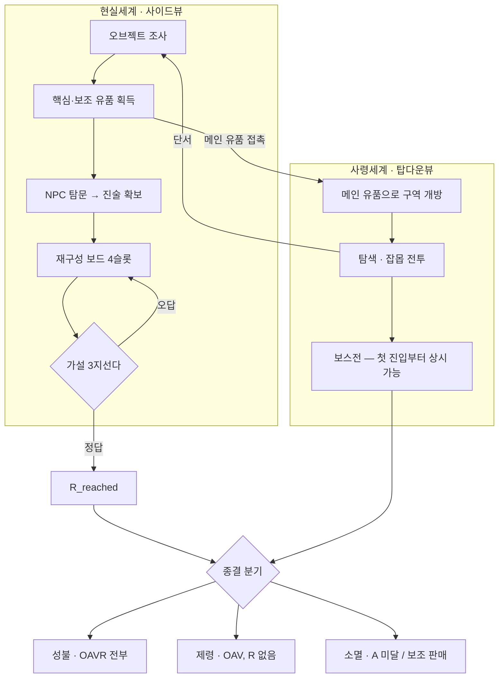

# 시스템 전체 구조 — 한 장 요약

확정된 ADR 10건이 하나로 맞물린 모습. 세부는 각 문서 참조.

## 한 문장

> **현실에서 유품을 모아 고인을 오해하고, 사령세계에서 그 오해가 깨지며, 얼마나 이해했는가가 종결 방식을 바꾼다.**

이해도는 **전투력이 아니라 종결 열쇠**이고, 플레이어에게 숫자로 보여주지 않는다.

---

## 코어 루프



---

## 4개 축이 어떻게 맞물리나

| 축 | 무엇 | 문서 |
|---|---|---|
| **측정** | 이해도 = 인식 변화량. 출력은 보스 패턴 가시성 + 종결 해금 **2종뿐** | [[이해도_정의와_출력]] |
| **표현** | O→A→V→R 4개 boolean, 순서 의존. 가중 합산 금지 | [[이해도_4플래그_파이프라인]] |
| **입력** | 핵심 3개(판매 불가) + 보조 10~12개(판매 가능) | [[아이템_위계]] |
| **무대** | 재구성 보드 4슬롯 · 4 STEP · all-or-nothing 검증 | [[재구성보드_4슬롯]] |

### 핵심 설계 원리 3가지

**1. R 없이는 성불 불가 — 데이터 구조로 강제**
가중 합산이면 R=0이어도 다른 축 합으로 성불에 도달할 수 있다. 4개 boolean AND는 그걸 원천 차단한다. 이게 4플래그를 택한 진짜 이유다.

**2. 판매 가능 여부가 곧 위계**
핵심=판매 불가, 보조=판매 가능. 그리고 **보조 유품 판매가 소멸 루트의 메카닉**이다. "이해하지 않기로 한 플레이어"에게도 진행 경로를 주는 장치.

**3. 세 종결이 같은 구조 위에서 갈린다**
별도 분기 시스템이 아니라, 같은 4플래그의 도달 정도가 곧 종결이다.

---

## 세계 · 전투 규칙

| 항목 | 결정 | 문서 |
|---|---|---|
| 사령세계 장르 | 메트로배니아 ARPG (선형 진행 금지) | [[사령세계_구조]] |
| 보스방 | 탐색 영역과 **분리된 독립 공간**, 첫 진입부터 도전 가능 | [[사령세계_구조]] |
| 시점 | 현실=사이드뷰 / 사령=탑다운뷰 (챕터1 기준) | [[게임_시점]] |
| 전투 | 가벼움 + **회피만**. 패링·가드 금지 | [[전투_톤]] |
| 잡몹 | 평타 처리, 이해도 무관 | [[전투_톤]] |

---

## 확정 vs 미확정 경계

```
✅ 확정 (Accepted, ADR-1~10)          ⚠️ 미확정 (Proposed, ADR-11~14)
─────────────────────────────         ─────────────────────────────
이해도 정의·출력 범위                   각 단계의 구체적 판정 트리거
4플래그 구조와 순서 의존                 사령세계 구역이 열리는 규칙
아이템 2등급·수량                       인벤토리/플래그/컷씬 3계층 분리
보드 4슬롯·3지선다·NPC 분리              오답 재시도 처리
메트로배니아·시점·전투 톤
```

**즉 "무엇을 만들 것인가"는 정해졌고, "어떤 조건에서 무엇이 열리는가"는 아직 유동적이다.**

미확정 4건은 서로 강하게 얽혀 있어(ADR-12↔13↔11, ADR-14는 12에서 분리) 한꺼번에 확정하는 게 자연스럽다. 순서 제안은 [[미결_현황]] 참조.

---

## 지금 이 시스템을 막고 있는 것

| # | 항목 | 왜 막히나 |
|---|---|---|
| 1 | **메인 유품 정체성 + 공간 개방 구조** | ADR-11(순차 체인) ↔ 스토리 자료(동시 노출)가 정면 충돌. 레벨디자인 착수 불가 |
| 2 | 1단계 O 임계값 N | 맵 초안·유품 배치가 나와야 정할 수 있음 |
| 3 | 컷오프 정의 + R 미달 보스전 결과 | 같은 문제의 양면. 보스전 구현 전 필요 |

→ 상세 [[미결_현황]]

## 관련
[[_INDEX]] · [[00_준수_체크리스트]] · [[미결_현황]]
